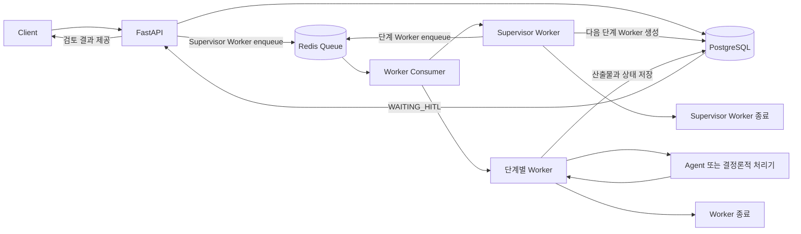
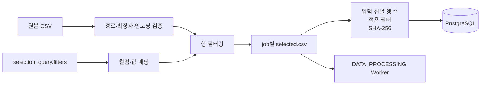
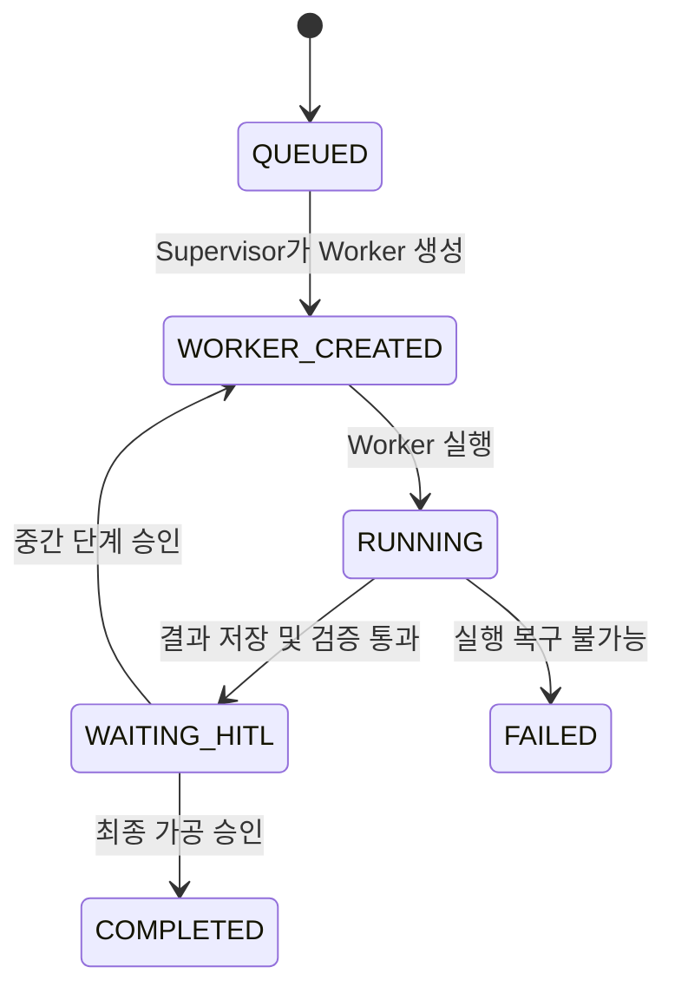

# 자동화 Supervisor·Worker 파이프라인 구조

## 1. 문서 목적

이 문서는 현재 구현된 자동화 파이프라인의 구조와 실행 흐름을 설명한다.

주요 목적은 다음과 같다.

- Supervisor와 Worker의 책임 구분
- 요구사항 분석, 데이터 선별, 데이터 조회, 데이터 가공 단계의 역할 설명
- 단계별 PostgreSQL 상태 변화 설명
- 실제 CSV 테스트에서 검증된 범위 기록
- 현재 구현과 목표 구조의 차이 정리
- 앞으로 해결해야 할 문제와 구현 우선순위 정리

반려 피드백에 따른 자동 롤백 정책은 향후 설계 범위이며, 현재 핵심 흐름은
**각 단계 실행 → 결과 저장 → Client 승인 → 다음 단계 실행**이다.

---

## 2. 전체 개념

현재 자동화 파이프라인은 다음 네 종류의 구성 요소로 나뉜다.

| 구성 요소 | 책임 |
|---|---|
| FastAPI | Job 생성, 상태 조회, Client 승인 요청 수신 및 Redis 작업 등록 |
| Redis | 실행할 Worker 작업을 Queue에 저장하고 Worker Consumer에 전달 |
| Worker Consumer | Redis 작업 이름에 맞는 Worker 함수 실행 |
| Supervisor Worker | 현재 DB 상태를 보고 다음 단계 Worker 하나를 생성·enqueue |
| 단계별 Worker/Agent | 자기 단계 하나만 실행하고 결과를 DB에 저장 |
| PostgreSQL | Job, Worker, 입력, 산출물, 검증 결과, 상태 이력 저장 |

Supervisor도 Worker의 한 종류다. Supervisor Worker는 모든 Agent를 연속 실행하지 않는다.
다음에 필요한 단계 Worker 하나만 DB에 `PENDING`으로 생성하고 Redis Queue에 실행 작업을
등록한 뒤 종료한다.

Worker는 자신에게 할당된 단계 하나만 실행한다. 실행 결과를 저장하고 Job을 승인 대기
상태로 변경한 뒤 종료한다.



---

## 3. 단계별 전체 흐름

현재 정의된 정상 승인 흐름은 다음과 같다.

```mermaid
flowchart TD
    Start["Job 생성<br/>QUEUED"]

    Start --> S1["Supervisor 실행"]
    S1 --> W1["REQUIREMENT_ANALYSIS Worker 생성<br/>PENDING"]
    W1 --> A1["요구사항 분석 Agent 실행"]
    A1 --> D1[("분석 결과 DB 저장")]
    D1 --> H1["Client 승인 대기<br/>WAITING_HITL"]

    H1 --> S2["승인 후 Supervisor 재호출"]
    S2 --> W2["DATA_SELECTION Worker 생성<br/>PENDING"]
    W2 --> A2["데이터 선별 Agent 실행"]
    A2 --> D2[("테이블·필터·컬럼 계획 저장")]
    D2 --> H2["Client 승인 대기<br/>WAITING_HITL"]

    H2 --> S3["승인 후 Supervisor 재호출"]
    S3 --> W3["DATA_RETRIEVAL Worker 생성<br/>PENDING"]
    W3 --> R1["실제 CSV에 식별 조건 적용"]
    R1 --> R2["선별된 selected.csv 생성"]
    R2 --> D3[("행 수·필터·경로·SHA-256 저장")]
    D3 --> H3["Client 승인 대기<br/>WAITING_HITL"]

    H3 --> S4["승인 후 Supervisor 재호출"]
    S4 --> W4["DATA_PROCESSING Worker 생성<br/>PENDING"]
    W4 --> P1["선별 CSV 체크섬 검증"]
    P1 --> P2["정규화·중복·결측값·가명화 처리"]
    P2 --> P3["CSV·API·시각화·보고서 생성"]
    P3 --> D4[("가공 결과 저장")]
    D4 --> H4["최종 Client 승인 대기<br/>WAITING_HITL"]

    H4 --> Done["최종 승인<br/>COMPLETED"]
```



---

## 4. Supervisor Worker 개념

### 4.1 책임

Supervisor Worker는 Redis를 통해 실행되는 Worker 중 하나이며 직접 데이터를 분석하거나
가공하지 않는다.

Supervisor의 책임은 다음과 같다.

1. 현재 Job 상태 조회
2. 이미 실행 중인 Worker가 있는지 확인
3. 이전 단계 결과 조회
4. 다음 단계 입력 payload 생성
5. 다음 단계 Worker 하나를 `PENDING` 상태로 생성
6. Redis Queue에 단계 Worker 실행 작업 등록
7. Job 상태를 `WORKER_CREATED`로 변경
8. 실행 종료

### 4.2 Supervisor가 하지 않는 일

- 원본 CSV 직접 처리
- 자연어 요구사항 분석
- 데이터 필터링
- 결측값 처리
- 가명화
- 여러 단계를 한 번에 연속 실행

### 4.3 현재 Supervisor 단계 순서

```text
REQUIREMENT_ANALYSIS
→ DATA_SELECTION
→ DATA_RETRIEVAL
→ DATA_PROCESSING
```

### 4.4 관련 구현

- `automation-supervisor-api/app/application/supervisor_service.py`
- `automation-supervisor-api/app/domain/enums.py`
- `automation-supervisor-api/app/domain/models.py`

---

## 5. 요구사항 분석 Agent

### 5.1 목적

사용자의 자연어 요청을 다음 단계가 사용할 수 있는 구조화된 JSON으로 변환한다.

### 5.2 입력 예

```text
일본에서 숙박 결제를 한 20대 여성의 결제 데이터를 CSV와 보고서로 제공해줘.
```

### 5.3 출력 개념

```json
{
  "usage_purpose": "명시되지 않음",
  "requested_data_sentence": "일본 숙박 결제 데이터 제공",
  "categories": {
    "국가": "일본",
    "업종": "숙박",
    "연령대": "20대",
    "성별": "여성"
  },
  "delivery_channel": "api",
  "output_formats": ["csv", "report"]
}
```

### 5.4 구현 특성

- Strands Agents SDK 사용
- DeepSeek OpenAI 호환 API 사용
- temperature 0
- 모델 응답을 JSON으로 파싱
- 호출 또는 파싱 실패 시 최대 3회 재시도
- 실제 CSV 행이나 원본 데이터를 LLM에 전달하지 않음

### 5.5 관련 구현

- `agent_runtime/requirements_analysis/agent.py`
- `agent_runtime/requirements_analysis/config.py`

---

## 6. 데이터 선별 Agent

### 6.1 목적

요구사항 분석 결과를 바탕으로 다음 내용을 설계한다.

- 필요한 데이터 테이블
- 데이터 필터 조건
- 조회 계획
- 검토 및 가공에 필요한 컬럼
- 선택한 컬럼 형식에 맞춘 합성 더미 샘플 5건

이 Agent는 조회 계획과 고객 확인용 합성 샘플을 생성한다. 실제 CSV 행을 직접 읽거나
샘플에 복사하지 않는다.

### 6.2 출력 예

```json
{
  "selected_tables": [
    {
      "table": "transaction_pseudonymized",
      "reason": "결제 거래 분석에 필요"
    }
  ],
  "selection_query": {
    "vector_similarity": true,
    "top_k": 20,
    "filters": {
      "국가": "일본",
      "업종": "숙박",
      "성별": "여성"
    }
  },
  "sample_columns": [
    {
      "name": "국가",
      "data_type": "string",
      "is_predicted": false
    },
    {
      "name": "결제건수",
      "data_type": "integer",
      "is_predicted": true
    }
  ],
  "sample_rows": [
    {"국가": "일본", "결제건수": 12},
    {"국가": "일본", "결제건수": 18},
    {"국가": "일본", "결제건수": 9},
    {"국가": "일본", "결제건수": 21},
    {"국가": "일본", "결제건수": 15}
  ],
  "sample_metadata": {
    "is_synthetic": true,
    "sample_count": 5,
    "notice": "실제 고객 데이터가 아닌 형식 확인용 예시 데이터입니다."
  }
}
```

### 6.3 역할 구분

```text
데이터 선별 Agent
→ 무엇을 골라야 하는지 설계하고 더미 샘플 5건 생성

DATA_RETRIEVAL Worker
→ 설계된 조건을 실제 데이터에 적용
```

### 6.4 관련 구현

- `agent_runtime/data_selection/agent.py`
- `agent_runtime/data_selection/config.py`

---

## 7. DATA_RETRIEVAL Worker

### 7.1 목적

데이터 선별 Agent가 만든 조건을 실제 CSV에 적용하여 가공 대상 행만 추출한다.

이 Worker는 LLM Agent가 아니라 결정론적 Python Worker다. 같은 입력과 같은 조건에 대해
항상 같은 결과를 생성한다.

### 7.2 처리 흐름



### 7.3 지원하는 필터 매핑

| 식별 Agent 조건 | CSV 컬럼 |
|---|---|
| 성별 | `gender` |
| 연령대, 나이 | `age_band` |
| 지역, 거주지역 | `resident_region` |
| 국가, 여행국가, 목적지 | `destination_country_name` |
| 업종, 소비 카테고리 | `spend_category`, `mcc_name` |
| 승인 채널, 결제 채널 | `approval_channel` |
| 인증 방식 | `auth_method` |
| 소득 구간 | `annual_income_band` |

### 7.4 값 변환 예

| Agent 값 | CSV 값 |
|---|---|
| 여성 | `F` |
| 남성 | `M` |
| 숙박, 호텔 | `lodging`, `호텔/숙박` |
| 식음료, 음식점 | `dining`, `음식점` |
| 쇼핑 | `shopping`, `백화점` |
| 교통 | `transport`, `해외 교통/승차공유` |
| 온라인 | `온라인_PG` |

`20대~40대`와 같은 연령 범위도 `20대`, `30대`, `40대`로 확장하여 처리한다.

### 7.5 실패 정책

다음 조건에서는 전체 데이터를 그대로 가공 단계에 넘기지 않고 Worker를 실패 처리한다.

- 매핑할 수 없는 필터
- 필요한 CSV 컬럼 부재
- 값이 없는 필터
- 필터 결과 0행
- 허용 디렉터리 밖의 파일 접근
- CSV가 아닌 파일
- 최대 허용 행 수 초과

### 7.6 DB 저장 산출물 예

```json
{
  "input_csv_path": "/data/02_selected_transactions.csv",
  "input_row_count": 1600,
  "source_csv_path": "/data/jobs/job-1/selected.csv",
  "row_count": 40,
  "applied_filters": [
    {
      "filter": "국가",
      "requested": "일본",
      "columns": ["destination_country_name"],
      "resolved_values": ["일본"]
    }
  ],
  "unmapped_filters": [],
  "source_sha256": "...",
  "raw_rows_stored_in_database": false
}
```

원본 행과 선별된 행 자체는 Supervisor DB에 저장하지 않는다. 파일 경로, 행 수, 컬럼,
필터 정보와 체크섬만 저장한다.

### 7.7 관련 구현

- `agent_runtime/data_retrieval/agent.py`

---

## 8. 데이터 가공 Worker

### 8.1 목적

DATA_RETRIEVAL Worker가 생성한 선별 CSV만 읽어 최종 산출물을 생성한다.

### 8.2 처리 기능

- CSV 체크섬 재검증
- 문자열 공백 및 null 값 정규화
- 컬럼 타입 변환
- 완전히 동일한 행 중복 제거
- 결측값 중앙값 또는 최빈값 보정
- 직접 식별자 HMAC-SHA256 가명화
- 준식별자 일반화
- API 결과 생성
- UTF-8 BOM CSV 생성
- 시각화용 데이터 생성
- 가공 결과 보고서 생성
- 품질 보고서 생성

### 8.3 보안 원칙

- 원본 행을 LLM에 보내지 않음
- 직접 식별자를 감사 로그에 기록하지 않음
- `customer_id`, `email`, `phone` 등은 가명화 키 없이는 처리 거부
- 조회 단계에서 기록한 SHA-256과 실제 파일이 다르면 처리 거부

### 8.4 관련 구현

- `agent_runtime/data_processing/agent.py`
- `agent_runtime/data_processing/processor.py`

---

## 9. PostgreSQL 상태 모델

### 9.1 Job 상태

| 상태 | 의미 |
|---|---|
| `QUEUED` | Job이 생성되고 Supervisor 실행을 기다림 |
| `WORKER_CREATED` | Supervisor가 다음 Worker를 생성함 |
| `RUNNING` | 현재 Worker가 실행 중 |
| `WAITING_HITL` | Worker 결과 저장 완료, Client 승인 대기 |
| `COMPLETED` | 마지막 가공 결과가 승인됨 |
| `FAILED` | 복구 없이 Job 실패 |
| `WAITING_RETRY` | 재실행을 위한 중간 상태 |

### 9.2 Worker 상태

| 상태 | 의미 |
|---|---|
| `PENDING` | Worker 생성 완료, 실행 대기 |
| `RUNNING` | Worker 실행 중 |
| `COMPLETED` | 산출물 검증 통과 |
| `FAILED` | 실행 또는 산출물 검증 실패 |
| `ROLLED_BACK` | 후속 정책에 의해 무효화된 과거 실행 |
| `CACHED` | 캐시 산출물 사용 |

### 9.3 정상 승인 상태 전이



### 9.4 DB 테이블

`automation_jobs`

- Job 전체 상태
- 현재 단계
- 진행률
- 최종 산출물 메타데이터
- 시작 및 완료 시각

`automation_stage_runs`

- Worker 단계 이름
- 실행 상태
- 입력 payload
- 출력 payload
- 검증 결과
- 오류 메시지
- 실행 순서와 실행 시간

`stage_artifact_caches`

- 단계 입력 기반 캐시 키
- 재사용 가능한 단계 산출물

---

## 10. FastAPI API 흐름

### 10.1 Job 생성

```http
POST /api/v1/supervisor/jobs
```

```json
{
  "raw_requirement": "일본 숙박 데이터를 분석해 CSV와 보고서로 제공해줘.",
  "source_csv_path": "/data/02_selected_transactions.csv"
}
```

### 10.2 Supervisor Worker enqueue

```http
POST /api/v1/supervisor/jobs/{job_id}/run
```

FastAPI는 Supervisor 로직을 직접 실행하지 않는다. Job 상태를 `SUPERVISOR_QUEUED`로 저장하고
Redis Queue에 `run_supervisor_worker(job_id)` 작업을 등록한다. Worker Consumer가 이 작업을
가져가 Supervisor Worker를 실행한다.

### 10.3 단계 Worker 실행

Supervisor Worker는 다음 단계 레코드를 `PENDING`으로 생성하고 Redis Queue에
`run_stage_worker(stage_id)`를 등록한다. Worker Consumer가 작업을 가져가 단계 Worker를
자동 실행한다. 일반 Client가 Worker 실행 API를 직접 호출하지 않는다.

### 10.4 Client 승인

```http
POST /api/v1/supervisor/jobs/{job_id}/hitl-review
```

```json
{
  "approved": true,
  "reviewer": "client01",
  "natural_feedback": "승인합니다."
}
```

중간 단계가 승인되면 Supervisor가 다음 Worker 하나를 생성한다. `DATA_PROCESSING` 단계가
승인되면 Job이 `COMPLETED`가 된다.

### 10.5 상태 조회

```http
GET /api/v1/supervisor/jobs/{job_id}
```

---

## 11. 실제 CSV 테스트 결과

테스트 파일:

```text
/Users/gunho/Downloads/02_selected_transactions.csv
```

파일 특성:

- 데이터 행: 1,600행
- 컬럼: 17개
- 여행 결제 데이터
- 직접 식별자 `customer_id` 포함

실제 필터 테스트:

```json
{
  "국가": "일본",
  "업종": "숙박",
  "성별": "여성"
}
```

결과:

```text
원본 입력              1,600행
필터 적용 결과            40행
데이터 가공 입력           40행
데이터 가공 출력           40행
customer_id 가명화         40건
```

검증된 내용:

- 한국어 필터 키를 실제 CSV 컬럼으로 변환
- 한국어 조건 값을 실제 CSV 코드 값으로 변환
- 모든 조건을 AND 방식으로 적용
- 선별 CSV 생성
- 조회 결과 SHA-256 생성
- 가공 전 체크섬 재검증
- 선별 행만 데이터 가공
- 직접 식별자 가명화
- CSV 산출물 생성
- 매핑 불가능한 필터 차단
- 허용 경로 밖 파일 접근 차단
- 조회 이후 변경된 파일 차단

테스트 결과:

```text
데이터 조회·필터·가공 테스트    8 passed
Supervisor 상태 전이 테스트     3 passed
```

---

## 12. 현재 구현된 범위와 아직 구현되지 않은 범위

### 12.1 구현 완료

- 요구사항 분석 Agent
- 데이터 선별 Agent
- CSV DATA_RETRIEVAL Worker
- 식별 조건의 실제 CSV 적용
- 선별 CSV 생성
- 조회 메타데이터 및 체크섬 생성
- 선별 CSV와 데이터 가공 Worker 연결
- 가명화, 정규화, 중복 및 결측값 처리
- CSV, API, 시각화, 보고서 산출물 생성
- Supervisor 단계별 Worker 생성
- Worker 실행 결과 DB 저장 구조
- 단계별 Client 승인 구조
- Supervisor 승인 체인 단위 테스트

### 12.2 부분 구현 또는 미구현

- 전체 승인 체인을 마지막 가공 단계까지 진행하는 자동화 통합 테스트
- Client CSV 업로드 API
- 공유 볼륨 또는 S3 기반 파일 저장
- 대용량 가공 산출물의 외부 스토리지 분리
- 동시 실행 제어와 DB 잠금
- API 인증 및 서비스 간 인증
- Alembic DB 마이그레이션
- 범위, 비교, 제외, 날짜 조건 등 고급 필터
- 운영용 모니터링 및 장애 복구

---

## 13. 앞으로 해결해야 할 문제

### 완료: 실제 PostgreSQL 상태 전이 통합 테스트

Docker Compose의 PostgreSQL, Redis, FastAPI, Worker Consumer를 사용해 다음 상태 전이를
실데이터로 검증했다.

```text
QUEUED
→ SUPERVISOR_QUEUED
→ Supervisor Worker가 단계 실행 레코드 생성
→ 단계 Worker RUNNING
→ WAITING_HITL
→ 승인
→ SUPERVISOR_QUEUED
```

남은 운영 검증은 프로세스 강제 종료·재시작 이후의 작업 복구와 중복 실행 방지다.

### 완료: Redis 기반 Worker dispatch

FastAPI는 Redis에 Supervisor Worker 작업을 등록하고, Worker Consumer는 Supervisor Worker와
단계 Worker를 모두 실행한다.

```text
FastAPI → Redis → Worker Consumer → Supervisor Worker
Supervisor Worker → Redis → Worker Consumer → 단계 Worker
```

### 완료: Docker Compose 서비스 통합

현재 Compose 서비스는 다음 네 가지다.

```text
fastapi
db
redis
worker
```

`worker` 컨테이너 안에서 Supervisor Worker와 모든 단계 Worker가 실행된다. FastAPI와 Worker가
같은 선별 CSV를 볼 수 있도록 공유 `/data` 볼륨도 사용한다.

```text
/data/original
/data/jobs/{job_id}/selected.csv
/data/results/{job_id}/output.csv
```

### 우선순위 4: CSV 업로드와 Artifact 관리

현재 API 사용자가 컨테이너 내부 경로를 직접 전달한다.

```json
{
  "source_csv_path": "/data/input.csv"
}
```

운영 환경에서는 다음 구조로 변경해야 한다.

```text
Client CSV 업로드
→ FastAPI가 파일 저장
→ artifact_id 발급
→ Job에는 artifact_id만 전달
```

권장 저장소:

- 로컬 개발: Docker named volume
- 운영: S3 또는 동등한 객체 스토리지

### 우선순위 5: 실패 Worker 승인 차단

실패한 Worker 결과는 Client가 승인할 수 없어야 한다.

```text
COMPLETED Worker → 승인 가능
FAILED Worker    → 승인 불가능
```

실패 상태는 `WAITING_HITL`과 구분하고 재시도 또는 운영자 조치만 허용해야 한다.

### 우선순위 6: 반려 정책 분리

반려에 따른 자동 롤백 정책은 아직 확정된 현재 범위가 아니다.

현재 목표:

```text
반려
→ 반려 사유 DB 저장
→ 후속 Worker 자동 생성 안 함
→ 정책 확정까지 정지
```

현재 남아 있는 자동 분류 및 롤백 코드는 후속 정책 확정 전 비활성화하거나 별도 기능
플래그로 격리해야 한다.

### 우선순위 7: 가공 산출물 외부 저장

현재 가공 산출물에는 API 행 전체와 Base64 CSV가 포함될 수 있다. 대용량 데이터를
PostgreSQL JSONB에 직접 저장하면 DB 크기와 응답 시간이 증가한다.

권장 구조:

```text
가공 CSV·JSON·보고서 → 파일 또는 객체 스토리지
PostgreSQL → artifact_id, 경로, 행 수, SHA-256, 크기만 저장
```

### 우선순위 8: 동시 실행과 Idempotency

동시에 두 Supervisor 요청이 들어오면 같은 Job에 Worker가 중복 생성될 가능성이 있다.

필요 작업:

- Job 행 `SELECT FOR UPDATE`
- Job당 활성 Worker 하나만 허용
- API idempotency key
- 완료된 Worker 재실행 차단
- Worker heartbeat 및 timeout

### 우선순위 9: 필터 표현 확장

현재 필터는 주로 등가 비교와 일부 문자열 포함 및 연령 범위를 지원한다.

앞으로 필요한 조건:

- `10만원 이상`
- `20만원 미만`
- `최근 3개월`
- `일본 또는 태국`
- `숙박 제외`
- `서울과 경기`
- 날짜 범위

장기적으로 다음과 같이 구조화된 필터 계약이 필요하다.

```json
{
  "field": "krw_converted_amount",
  "operator": "gte",
  "value": 100000
}
```

### 우선순위 10: 인증과 권한

FastAPI는 일반 Client API와 Redis 내부 Worker 실행을 구분해야 한다.

- Client: Job 생성, 자신의 Job 조회, 승인
- Redis Worker Consumer: Worker 실행
- 관리자: 전체 Job 및 오류 조회

단계 Worker 실행용 공개 API는 제거됐으며 Redis Worker Consumer만 Worker 함수를 실행한다.

### 우선순위 11: DB 마이그레이션

현재 개발 환경은 SQLAlchemy `create_all()`을 사용한다. 기존 테이블 변경 및 운영 배포를
위해 Alembic 마이그레이션을 도입해야 한다.

### 우선순위 12: 운영 관측성과 오류 복구

필요 항목:

- 단계별 구조화 로그
- Job 및 Worker correlation ID
- Agent 호출 시간과 실패 원인
- PENDING 또는 RUNNING timeout
- 비정상 종료 Worker 재처리
- CSV 행 수 및 산출물 크기 지표
- 민감정보가 로그에 포함되지 않는지 검사

---

## 14. 권장 구현 순서

```text
1. 실패 Worker 승인 차단
2. 반려 자동 롤백 비활성화
3. 전체 승인 체인 end-to-end 테스트
4. CSV 업로드 및 Artifact API 구현
5. 가공 산출물 외부 스토리지 분리
6. Queue enqueue와 DB commit의 원자성 보강
7. 동시 실행 잠금 및 Idempotency
8. 고급 필터 연산자 추가
9. 인증 및 권한 연결
10. Alembic 및 운영 모니터링 도입
```

---

## 15. 현재 상태 요약

현재 파이프라인은 다음 기능까지 실제 CSV로 검증됐다.

```text
자연어 요구사항 분석
→ 데이터 선별 조건 설계
→ 실제 CSV에 조건 적용
→ 선별된 행만 별도 CSV로 생성
→ 체크섬 기반 안전한 전달
→ 선별 데이터만 가공
→ 가명화 및 산출물 생성
```

Redis Queue, Worker Consumer, PostgreSQL, Docker Compose 연결은 실제 요구사항 분석과 데이터
선별 단계까지 검증됐다. 다음 핵심 목표는 모든 승인 단계를 거쳐 조회와 가공까지 하나의
end-to-end 테스트로 완주하고 Queue와 DB 사이의 장애 복구를 보강하는 것이다.
