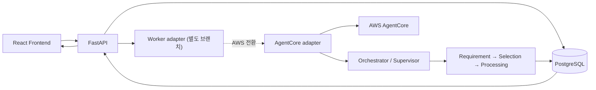

# Backend Architecture Overview

> 기준: 2026-07-23  
> `origin/main` → `joungs` 병합 완료 (`a051ce7`)

## 1. 배경

이 백엔드는 단순 CRUD 서버가 아니라 **데이터 요청을 접수하고 여러 에이전트를 단계적으로 실행한 뒤, 사람이 검토하고 결과를 전달하는 서비스**를 목표로 한다.

현재 브랜치는 FastAPI와 PostgreSQL 기반의 요청·상태 계약을 제공한다. 에이전트 실행기와
메시지 브로커는 공동 작업을 위해 분리했으며, 별도 worker 설계 브랜치에서 연결한다.

```text
요구사항 분석 → 데이터 선별 → 데이터 가공 → HITL 검토 → 결과 전달
```

## 2. 브랜치별 역할

| 브랜치 | 중심 구현 |
|---|---|
| `main` | 요구사항 분석·데이터 선별·데이터 가공 runtime, 별도 Supervisor/HITL 실행 흐름, Docker/Jenkins |
| `joungs` | main 기능 전체 + 서비스 DB 모델 + 루트 FastAPI API + 인증 + 대시보드/프론트 연동 |

현재 `joungs`에는 최신 `main`이 병합되어 있다. 실행기는 별도 브랜치에서 pipeline DB 상태 계약 뒤에 연결한다.

## 3. 전체 목표 구조



실행 adapter는 실행 환경을 감추고, 공통 event·output·metric을 PostgreSQL에 기록한다.
현재 브랜치에는 adapter 구현이 포함되어 있지 않다.

## 4. 데이터 저장 흐름

### ① 요청 접수

`POST /api/v1/data-requests`

```text
data_requests
pipeline_runs (QUEUED)
stage_runs (REQUIREMENT_ANALYSIS / PENDING)
pipeline_events (최초 접수 event)
```

여기까지는 현재 구현되어 있다.

### ② 에이전트 실행

```text
stage_runs: PENDING → RUNNING → COMPLETED/FAILED
pipeline_runs: progress_percent, current_stage 갱신
pipeline_events: 진행 로그와 실패 event 누적
agent_metrics: token, latency, cost 기록
```

DB 모델은 준비됐지만, 요청 생성 후 worker를 호출하고 상태를 갱신하는 연결은 아직 없다.

### ③ 산출물과 화면 데이터

```text
artifacts                 실제 파일·결과 메타데이터
task_view_snapshots       프론트 단계별 조회용 read model
```

현재 `task_view_snapshots`는 데모 seed가 생성한다. 이후에는 에이전트 output을 projection해서 자동 생성해야 한다.

### ④ HITL 검토와 전달

```text
reviews       승인·수정 요청과 피드백
deliveries    다운로드/API/이메일 전달 상태
```

테이블과 별도 Supervisor 실험 코드는 있지만, 루트 FastAPI의 실제 승인 API와 상태 전이는 아직 구현되지 않았다.

## 5. 현재 코드 구조

```text
Backend-fastapi/
├── app/
│   ├── domains/auth/          # JWT, refresh token, 로그인 세션
│   ├── domains/employees/     # 직원·권한·관리자 기능
│   ├── domains/pipeline/      # 요청·실행·단계·event·산출물 DB/API
│   ├── domains/dashboard/     # 프론트 대시보드 read API
│   ├── domains/automation/    # 요구사항 분석 에이전트 단독 호출 API
│   └── pipeline/              # 실행기 연결 전까지 비워 둔 영역
├── agent_runtime/
│   ├── requirements_analysis/
│   ├── data_selection/
│   └── data_processing/
├── automation-supervisor-api/ # 별도 Supervisor/HITL 실험 앱
└── scripts/                    # 데모 사용자·원천 데이터·화면 데이터 seed
```

### 현재 분리되어 있는 두 실행 경로

1. 루트 FastAPI는 요청과 pipeline 상태를 DB에 저장하지만 에이전트를 실행하지 않는다.
2. `automation-supervisor-api`는 세 에이전트와 HITL dry-run을 실행하지만 루트 DB·프론트 흐름과 연결되지 않았다.

다음 단계는 두 코드를 합쳐 새 구조를 만드는 것이 아니라, 별도 worker adapter를 통해 Supervisor를 연결하는 것이다.

## 6. 프론트와의 통신

현재 프론트는 다음 흐름을 실제 API로 사용한다.

```text
로그인
→ 전체/내 작업 대시보드 조회
→ 요구사항 생성
→ run_id 기반 실행 상태 3초 polling
```

주요 API:

| Method | Endpoint | 용도 |
|---|---|---|
| `POST` | `/api/auth/login` | 로그인 |
| `GET` | `/api/auth/me` | 현재 사용자 |
| `GET` | `/api/v1/dashboard` | 전체 작업 |
| `GET` | `/api/v1/dashboard/my-tasks` | 내 담당 작업 |
| `POST` | `/api/v1/data-requests` | 새 요청 생성 |
| `GET` | `/api/v1/runs/{run_id}` | 단계·event·진행률 조회 |
| `GET` | `/api/v1/tasks/{request_no}/views/{view_code}` | 단계별 화면 read model |

현재는 SSE가 아니라 polling 방식이며, Access Token 자동 refresh와 다수 API의 인증 dependency는 보완이 필요하다.

## 7. 구현 상태와 다음 작업

### 구현됨

- 세 agent runtime과 Supervisor dry-run
- 인증·직원·세션
- 서비스 DB와 pipeline/event 모델
- 요청 생성 및 실행 상태 조회 API
- 대시보드와 프론트 연동
- worker 실행 환경은 별도 설계 브랜치에서 추가

### 다음 통합 순서

1. `POST /api/v1/data-requests` 이후 worker 호출 계약 확정
2. Worker에서 Supervisor와 agent runtime 호출
3. agent event/output을 `stage_runs`, `pipeline_events`, `artifacts`에 저장
4. output을 `task_view_snapshots`로 projection
5. HITL 승인·수정 요청 API와 `reviews` 상태 전이 구현
6. polling을 유지한 채 먼저 end-to-end를 완성한 후 SSE 추가
7. AWS 배포 시 실행 adapter를 AgentCore adapter로 교체

## 8. 팀 개발 기준

- agent runtime은 FastAPI ORM을 직접 import하지 않는다.
- 실행 상태의 기준은 `pipeline_runs → stage_runs → pipeline_events`다.
- 프론트는 worker 내부 작업 ID나 AgentCore session ID를 직접 알지 않는다.
- `.env`는 공유하지 않고 `.env.example`과 seed script로 환경을 재현한다.
- 스키마 변경은 운영 전 Alembic migration으로 전환한다.
