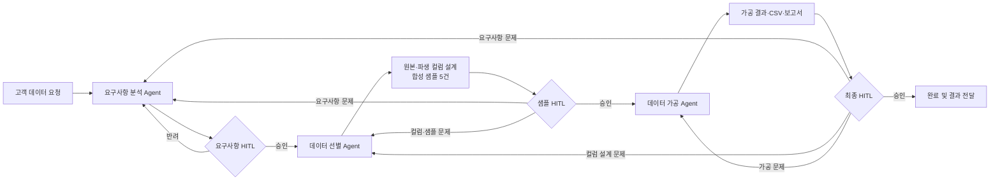
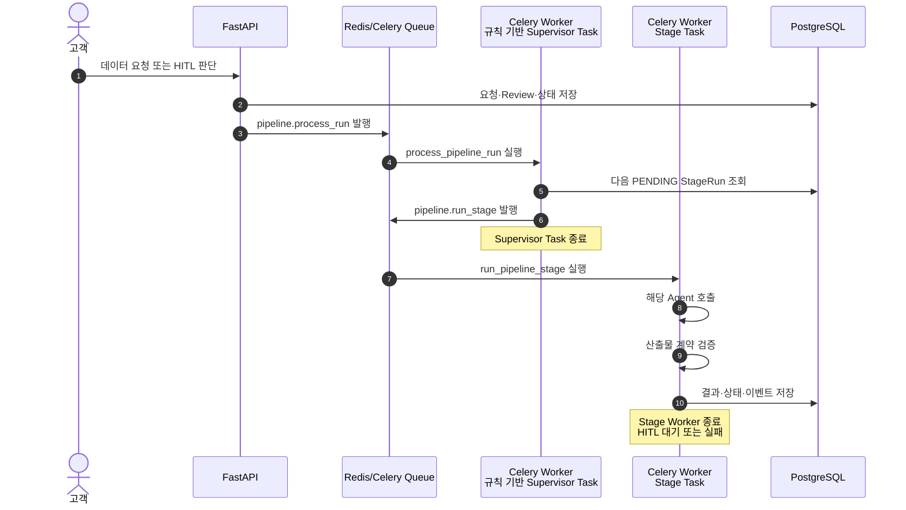
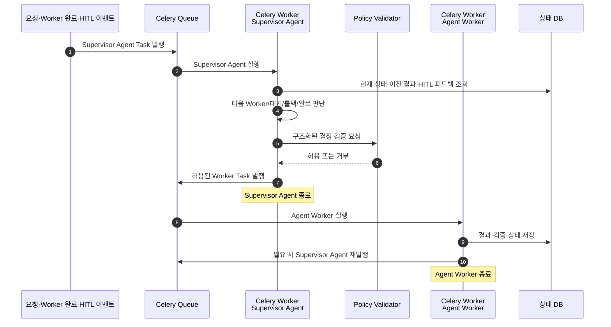

# Backend3 프로젝트 인수인계서

> 최종 갱신: 2026-07-31
> 저장소: `Aivle-team08-bigproject/Backend-fastapi`
> 작업 디렉터리: `/Users/gunho/Desktop/Bigproject/Backend3`
> 현재 브랜치: `kimjounggun`
> 기준 커밋: `9d2be66` (`feat:data selection fixed version2`)

## 0. 이 문서를 먼저 읽는 사람을 위한 요약

Backend3는 고객의 자연어 데이터 요청을 분석하고, Neon PostgreSQL의 가명 데이터 메타데이터를 이용해 필요한 원본·파생 컬럼을 설계한 뒤, HITL 검토와 실제 데이터 가공을 거쳐 결과를 제공하는 FastAPI 백엔드다.

현재 구현은 다음 특징을 가진다.

- FastAPI가 요청·HITL·결과 조회 API를 제공한다.
- PostgreSQL `service` 스키마가 요청, 단계, 검토, 이벤트, 산출물 상태를 저장한다.
- Celery와 Redis가 Supervisor 작업과 단계 Worker를 비동기로 실행한다.
- 요구사항 분석, 데이터 선별, 데이터 가공 Agent가 순차 실행된다.
- 각 Agent 단계가 끝날 때마다 HITL 승인 대기 상태로 멈춘다.
- 데이터 선별 Agent는 Neon DB `anonymized` 스키마의 COMMENT를 근거로 원본 컬럼과 파생 컬럼을 설계하고 합성 샘플 5건을 만든다.

가장 중요한 구분은 다음과 같다.

> **현재 코드의 Supervisor는 AI Agent가 아니다.** `STAGE_ORDER`와 `failure_code` 정책으로 동작하는 규칙 기반 디스패처다.
> **목표 구조의 Supervisor Agent는 아직 구현되지 않았다.** 향후 Celery Worker 내부에서 필요할 때 실행되어 다음 Worker를 판단하고 발행한 뒤 종료되는 AI Agent로 전환한다.

다음 담당자가 우선 처리해야 할 P0 작업은 두 가지다.

1. HITL 반려 피드백과 이전 결과를 재실행 Agent 입력에 전달한다.
2. `derived_columns`의 계산 규칙을 안전한 JOIN·GROUP BY·SUM·COUNT·AVG 실행 계획으로 변환해 실제 Neon 데이터에 적용한다.

---

## 1. 프로젝트 목표와 서비스 흐름

### 1.1 사용자 관점의 전체 흐름



### 1.2 현재 구현된 실행 단계

| 순서 | `StageName` | 실행 구현 | 완료 후 상태 |
|---:|---|---|---|
| 1 | `REQUIREMENT_ANALYSIS` | `requirement-analysis-agent` | `WAITING_REQUIREMENT_REVIEW` |
| 2 | `DATA_SELECTION` | `data-selection-agent` | `WAITING_SAMPLE_REVIEW` |
| 3 | `DATA_PROCESSING` | `data-processing-agent` | `WAITING_FINAL_REVIEW` |

`DATA_RETRIEVAL` 이름과 검증 계약은 남아 있지만 독립 실행 단계가 아니다. DB/CSV 조회는 `DATA_PROCESSING` 진입 시 Query Layer가 담당한다.

---

## 2. 현재 구현 아키텍처

### 2.1 Celery Worker 중심 구조

현재 `process_pipeline_run`은 “Supervisor”라는 이름을 사용하지만 AI 판단을 하지 않는다. DB에서 다음 `PENDING` 단계를 고르고 `run_pipeline_stage`를 발행한 뒤 종료한다.



### 2.2 현재 코드의 책임 분리

| 영역 | 파일 | 책임 |
|---|---|---|
| 요청·HITL 서비스 | `app/domains/pipeline/service.py` | 요청 생성, Review 저장, 승인 후 재발행, 반려 롤백 |
| 규칙 기반 Supervisor | `app/domains/pipeline/supervisor.py` | 다음 단계 선택, 입력 조립, Agent 호출, 결과 해석 |
| Agent 어댑터 | `app/domains/pipeline/agent_client.py` | 단계명과 `agent_runtime` 구현 연결 |
| 산출물 검증 | `app/domains/pipeline/validation.py` | 단계별 필수 키·형식·논리 계약 검사 |
| Celery Tasks | `app/worker/tasks.py` | Supervisor Task와 Stage Worker Task |
| 상태 기록 | `app/worker/status_recorder.py` | `PipelineRun`, `StageRun`, 이벤트, Artifact 저장 |
| 상태 전파 | `app/worker/status_publisher.py` | Redis/SSE용 상태 발행 |
| Agent 런타임 | `agent_runtime/` | 요구사항 분석, 선별, 조회, 가공 구현 |

### 2.3 주요 Celery Task

#### `pipeline.process_run`

- 구현: `process_pipeline_run()`
- DB의 `PipelineRun`과 `StageRun` 상태를 조회한다.
- `next_pending_stage()`로 다음 단계를 결정한다.
- `pipeline.run_stage`를 큐에 발행한다.
- 발행 후 즉시 종료한다.

#### `pipeline.run_stage`

- 구현: `run_pipeline_stage()`
- 선택된 단계의 Worker 역할을 한다.
- 해당 Agent 실행이 끝날 때까지 기다린다.
- 산출물을 검증하고 DB에 저장한다.
- 성공하면 해당 HITL 상태로 전환하고 종료한다.
- 실패하면 `FAILED` 및 `rollback_to_stage`를 저장하고 종료한다.

---

## 3. 목표 Supervisor Agent 아키텍처

이번 세션에서 합의한 목표는 Supervisor 자체를 “판단형 AI Agent”로 만드는 것이다. Supervisor Agent 역시 상시 실행 프로세스가 아니라 Celery Worker 안에서 실행되는 Task다.



### 3.1 Supervisor Agent가 받아야 할 입력

```json
{
  "run_id": 123,
  "raw_requirement": "고객 원본 요청",
  "current_stage": "DATA_SELECTION",
  "pipeline_status": "WAITING_SAMPLE_REVIEW",
  "completed_outputs": {},
  "latest_review": {
    "approved": false,
    "feedback": "평균 결제 금액 컬럼을 추가해주세요."
  },
  "validation_result": {},
  "available_workers": [
    "requirement-analysis-worker",
    "data-selection-worker",
    "data-processing-worker"
  ]
}
```

### 3.2 Supervisor Agent 출력 계약 제안

```json
{
  "action": "DISPATCH_WORKER",
  "worker": "data-selection-worker",
  "target_stage": "DATA_SELECTION",
  "reason": "샘플 반려 사유가 컬럼 설계 변경에 해당함",
  "worker_payload": {
    "review_feedback": "평균 결제 금액 컬럼을 추가해주세요."
  }
}
```

허용할 `action` 예시:

- `DISPATCH_WORKER`
- `WAIT_FOR_HITL`
- `RETRY_WORKER`
- `ROLLBACK`
- `COMPLETE`
- `FAIL`

### 3.3 반드시 유지할 Policy 안전장치

AI 판단 결과를 바로 실행하면 안 된다. 기존 규칙 기반 로직을 Policy Validator로 유지해 다음을 차단해야 한다.

- 존재하지 않는 Worker 또는 단계 실행
- 동시에 두 개 이상의 Stage Worker 실행
- HITL 승인 없이 다음 단계 진입
- 현재 상태에서 허용되지 않는 앞·뒤 단계 이동
- 무한 재시도 및 최대 attempt 초과
- 이전 Celery 실행의 지연 이벤트 반영
- 허용되지 않은 데이터셋·컬럼·SQL 사용

---

## 4. 데이터 선별 Agent

### 4.1 확정된 업무 정의

데이터 선별 Agent는 고객 요청에 필요한 DB 원본 컬럼을 COMMENT로 식별하고, 원본 컬럼을 계산·집계·분류·조합해 새로운 파생 컬럼을 설계한 뒤, 고객 검토용 합성 샘플 데이터 5건을 만든다.

행 개수 결정이나 실제 데이터 필터링이 중심이 아니므로 `top_k`, `limit`, `vector_similarity`를 Agent가 생성하지 않는다.

### 4.2 출력 계약

| 필드 | 의미 | 현재 검증 |
|---|---|---|
| `selected_tables` | 필요한 논리 데이터셋 | 비어 있지 않아야 함 |
| `source_columns` | DB에 존재하는 원본 컬럼 | `anonymized` 메타데이터와 일치해야 함 |
| `derived_columns` | 원본 컬럼으로 계산하는 신규 컬럼 | 최소 1개, 원본 참조·계산 규칙 필수 |
| `selection_query.columns` | 다음 단계에서 읽을 원본 컬럼 | `source_columns`와 집합이 일치해야 함 |
| `selection_query.filters` | 행 필터 | 선별 Agent에서는 빈 객체 |
| `sample_columns` | 고객에게 제시할 최종 컬럼 구조 | 이름이 존재하고 중복되지 않아야 함 |
| `sample_rows` | 검토용 완전 합성 데이터 | 정확히 5건, 선언된 컬럼과 일치 |
| `sample_metadata` | 합성 데이터 표시 | `is_synthetic=true`, `sample_count=5` |

### 4.3 이번 세션에서 반영된 변경

- `anonymized` 스키마의 테이블·컬럼 타입과 COMMENT를 조회하는 Metadata Loader 추가
- 기존 `top_k`·벡터 유사도 중심 프롬프트를 컬럼 설계 중심으로 교체
- DB에 없는 원본 컬럼 선택 차단
- 선택되지 않은 원본을 참조하는 파생 컬럼 차단
- `derived_columns=[]`를 성공으로 인정하지 않도록 변경
- 빈 파생 컬럼 또는 기타 계약 위반 시 최대 3회 재생성
- 이전 실패 이유를 `retry_feedback`으로 다음 모델 요청에 전달
- 3회 실패 시 `ok=false`와 최종 실패 사유 반환
- 합성 샘플 5건 계약 테스트 추가

관련 파일:

- `agent_runtime/data_selection/agent.py`
- `agent_runtime/data_selection/check_consistency.py`
- `agent_runtime/query/metadata.py`
- `agent_runtime/query/registry.py`
- `app/domains/pipeline/agent_client.py`
- `app/domains/pipeline/validation.py`
- `tests/test_data_selection_contract.py`
- `tests/test_query_layer.py`
- `tests/test_supervisor_flow.py`

### 4.4 실제 테스트에서 생성된 파생 컬럼 예시

- `travel_tx_count`
- `travel_total_amount`
- `travel_avg_amount`
- `overseas_travel_ratio`
- `online_payment_ratio`
- `installment_ratio`
- `night_payment_ratio`

### 4.5 아직 구현되지 않은 핵심

현재 파생 컬럼은 이름, 데이터 타입, 원본 컬럼, 자연어 계산 규칙을 **설계**한다. 이를 실제 SQL 집계로 실행하는 기능은 아직 완성되지 않았다.

예:

```text
travel_total_amount
  source: customer_id, mcc_code, approval_status, krw_converted_amount
  rule: 여행 업종 승인 거래의 고객별 원화 환산 금액 SUM
```

필요한 후속 구현:

- 허용된 집계 연산자 모델: `SUM`, `COUNT`, `AVG`, 비율
- 검증된 조건식 모델
- 등록된 JOIN 경로만 사용하는 Query Plan
- `GROUP BY` 키 검증
- 0으로 나누기 방지
- 파생 결과 타입 검증
- 계산 결과와 `sample_columns` 구조 일치 검증

---

## 5. Neon DB와 Query Layer

### 5.1 현재 결정

- CSV는 기본 운영 경로로 사용하지 않는다.
- `.env`의 `PIPELINE_QUERY_SOURCE=database`를 사용한다.
- 대상 스키마 이름은 `anon`이 아니라 **`anonymized`**다.
- DB 접속정보와 모델 API Key는 `.env`에만 보관하며 Git에 커밋하지 않는다.

### 5.2 확인된 데이터 규모

| 실제 테이블 | 확인된 행 수 |
|---|---:|
| `anonymized.cards` | 800 |
| `anonymized.customers` | 800 |
| `anonymized.mcc_codes` | 16 |
| `anonymized.merchants` | 150 |
| `anonymized.transactions` | 12,477 |

논리 데이터셋 매핑은 `agent_runtime/query/registry.py`를 기준으로 확인한다.

### 5.3 Query Layer 안전 원칙

- Agent가 만든 SQL 문자열을 직접 실행하지 않는다.
- 등록된 데이터셋과 허용 컬럼만 SQLAlchemy 식으로 변환한다.
- 민감 컬럼은 Registry에서 차단한다.
- 다중 데이터셋은 등록된 JOIN 경로만 허용한다.
- 서버가 자체 안전 한도를 적용한다.

현재 `SelectionPlan`은 호환성을 위해 `limit` 또는 `top_k`를 읽을 수 있지만, 선별 Agent 계약은 이를 생성하지 못하게 막는다. Agent가 조회량을 결정하지 않고 서버 기본 안전 한도가 적용되는 구조다.

### 5.4 MCC 관련 주의점

실제 테스트에서 모델이 여행 업종 MCC 범위를 자체 지식으로 작성할 수 있었다. 운영에서는 이를 허용하면 안 된다.

후속 작업:

- `mcc_codes`의 코드·업종명·COMMENT를 Agent 입력에 포함
- 실제 매핑에 존재하는 코드만 조건식에 허용
- 모델이 임의의 MCC 범위를 작성하면 계약 검증에서 차단

---

## 6. HITL 승인·반려와 재실행

### 6.1 승인 처리

`submit_stage_review()`가 승인 Review를 저장한다.

- 요구사항 승인: 다음 `DATA_SELECTION` 단계를 재발행
- 샘플 승인: 다음 `DATA_PROCESSING` 단계를 재발행
- 최종 승인: `PipelineRun`과 `DataRequest`를 `COMPLETED`로 마감

승인 후 `_redispatch()`가 새로운 `celery_task_id`로 `pipeline.process_run`을 발행한다.

### 6.2 반려 처리

현재는 `failure_code -> rollback_target()` 고정 정책을 사용한다.

| `failure_code` 예시 | 현재 롤백 단계 |
|---|---|
| `SCHEMA_INVALID`, `REQUIRED_KEY_MISSING` | `REQUIREMENT_ANALYSIS` |
| `MISINTERPRETED_REQUIREMENT`, `HUMAN_REJECTED` | `REQUIREMENT_ANALYSIS` |
| `INSUFFICIENT_DATA`, `DUPLICATED_DATA`, `OUTLIER_DETECTED` | `DATA_SELECTION` |
| `FORMAT_INVALID`, `PROCESSING_RULE_INVALID` | `DATA_PROCESSING` |

반려 대상 단계와 이후 단계는 `ROLLED_BACK`으로 변경된다. 새 `StageRun`은:

- `attempt_no = 이전 attempt_no + 1`
- `retry_of_id = 이전 StageRun.id`
- `status = PENDING`

으로 생성된다.

### 6.3 현재 HITL의 핵심 공백

사용자 `feedback`은 `reviews` 테이블에 저장되지만 재실행 Agent payload에는 포함되지 않는다. 따라서 현재 재실행은 피드백 기반 수정이 아니라 같은 원본 요청을 다시 실행하는 것에 가깝다.

다음 구현이 필요하다.

1. 현재 검토 Gate의 최신 Review 조회
2. 반려된 StageRun의 이전 `output_payload` 조회
3. `build_stage_payload()`에 아래 필드 추가

```json
{
  "review_feedback": "평균 결제 금액 컬럼을 추가해주세요.",
  "previous_output": {},
  "failure_code": "INSUFFICIENT_DATA",
  "attempt_no": 2
}
```

4. 각 Agent 프롬프트에 “이전 결과를 전체 교체하되 피드백을 반드시 반영” 규칙 추가
5. 피드백 반영 여부를 검증하는 HITL 통합 테스트 추가

---

## 7. 상태 모델과 실행 이력

### 7.1 핵심 테이블

| 테이블 | 역할 |
|---|---|
| `service.data_requests` | 고객 원본 요청과 요청 상태 |
| `service.pipeline_runs` | 전체 파이프라인 실행 상태 |
| `service.stage_runs` | 단계별 시도·입력·출력·검증 결과 |
| `service.reviews` | HITL 승인·반려·피드백 |
| `service.pipeline_events` | 진행·실패 이벤트 |
| `service.agent_metrics` | Agent 실행 지표 |
| `service.artifacts` | 최종 CSV 등 산출물 메타데이터 |

### 7.2 파이프라인 상태

```text
QUEUED
  -> RUNNING / REQUIREMENT_ANALYSIS
  -> WAITING_REQUIREMENT_REVIEW
  -> RUNNING / DATA_SELECTION
  -> WAITING_SAMPLE_REVIEW
  -> RUNNING / DATA_PROCESSING
  -> WAITING_FINAL_REVIEW
  -> COMPLETED
```

오류 또는 산출물 검증 실패 시 `FAILED`로 전환하며 `rollback_to_stage`를 기록한다.

### 7.3 Stale 이벤트 방지

재발행 시 새로운 `celery_task_id`를 발급한다. 상태 기록기는 현재 실행 ID와 다른 오래된 이벤트를 무시해야 한다. Supervisor Agent 전환 후에도 이 멱등성 기준을 유지해야 한다.

---

## 8. 테스트 현황

### 8.1 이번 세션에서 수행한 테스트

관련 자동화 테스트:

```bash
/private/tmp/backend3-test-venv/bin/pytest -q \
  tests/test_data_selection_contract.py \
  tests/test_query_layer.py \
  tests/test_supervisor_stages.py
```

결과:

```text
23 passed
```

실제 Neon DB + 모델 테스트:

```bash
/private/tmp/backend3-test-venv/bin/python \
  -m agent_runtime.data_selection.check_consistency \
  -n 1
```

확인 결과:

- 요구사항 분석 성공
- Neon DB COMMENT 조회 성공
- 원본 컬럼 선택 성공
- 파생 컬럼 7개 생성
- 합성 샘플 정확히 5건 생성
- `top_k`, `limit`, `vector_similarity` 미생성
- `sample_metadata.is_synthetic=true`

### 8.2 테스트 환경 주의

- 시스템 기본 Python에는 `pytest`가 없었다.
- 테스트를 위해 `/private/tmp/backend3-test-venv` 임시 환경을 생성했다.
- 이 경로는 영구 개발 환경으로 간주하면 안 된다.
- 새 담당자는 프로젝트 `.venv`를 만들고 `requirements.txt`와 `agent_runtime/requirements.txt`를 설치하는 것이 좋다.
- 실제 Neon DB와 DeepSeek 호출은 네트워크, 시간, API 비용이 발생한다.

### 8.3 아직 필요한 E2E 시나리오

1. 고객 요청 생성
2. 요구사항 Agent 실행
3. 요구사항 승인
4. 선별 Agent 실행 및 샘플 생성
5. 샘플 반려와 자연어 피드백 전달
6. 선별 Agent 재실행 및 피드백 반영 검증
7. 샘플 승인
8. 실제 파생 컬럼 가공 실행
9. 최종 결과 반려·재가공
10. 최종 승인과 CSV 다운로드

---

## 9. 알려진 문제와 우선순위

| 우선순위 | 문제 | 권장 작업 |
|---|---|---|
| P0 | HITL 피드백이 재실행 Agent 입력에 전달되지 않음 | 최신 Review·이전 결과를 payload에 포함 |
| P0 | 파생 컬럼이 설계만 되고 실제 집계 SQL로 실행되지 않음 | 안전한 Aggregate Query Plan 구현 |
| P1 | 현재 Supervisor가 AI Agent가 아닌 고정 순서 디스패처 | Supervisor Agent 입력·출력 계약 및 실행 Task 구현 |
| P1 | `validation.py`가 빈 `derived_columns`를 별도로 차단하지 않음 | Agent 내부 검증과 같은 방어 검증 추가 |
| P1 | MCC 업종 범위를 모델이 추론할 수 있음 | 실제 `mcc_codes` 매핑 기반으로 제한 |
| P1 | 서비스 DB 스키마와 ORM 불일치 가능성 | Alembic 적용 및 `pipeline_runs.error_message` 등 확인 |
| P1 | 단계별 최대 재실행 횟수와 DLQ 정책이 불명확 | 최대 attempt, timeout, dead-letter 정책 정의 |
| P2 | README의 일부 설명이 현재 코드와 다름 | 아래 문서 불일치 항목 정정 |
| P2 | 시각화·보고서 2차 가공 및 최종 QA Agent 미구현 | 후속 단계와 출력 계약 정의 |

### 9.1 README에서 주의할 오래된 설명

현재 README에는 다음과 같은 과거 설명이 혼재한다.

- “하드코딩 실행기” 또는 “외부 브로커 연결은 후속 작업”이라는 설명
- Query Layer가 `anon` 스키마를 조회한다는 설명
- 기본 `PIPELINE_QUERY_SOURCE=csv`라는 설명
- 삭제된 `.env.example`을 복사하라는 명령

현재 코드·환경 기준:

- Celery/Redis 파이프라인이 구현되어 있다.
- 데이터 스키마는 `anonymized`다.
- 현재 `.env`는 `PIPELINE_QUERY_SOURCE=database`다.
- 비밀값은 기존 `.env` 또는 별도 안전한 전달 경로로 설정해야 한다.

---

## 10. 다음 작업 권장 순서

### 작업 1: HITL 피드백 전달

- `service.py`에서 최신 Review와 이전 StageRun을 조회
- `build_stage_payload()`에 피드백·이전 결과 추가
- 요구사항/선별/가공 Agent가 수정 요청을 반영하도록 프롬프트 변경
- 통합 테스트 추가

### 작업 2: Supervisor 방어 검증 강화

- `derived_columns` 최소 1개
- 파생 컬럼 이름 중복 금지
- `data_type`, `derivation`, `description` 필수
- 파생 컬럼이 선택된 원본만 참조
- `sample_columns`에 모든 파생 컬럼이 포함되는지 확인

### 작업 3: 파생 컬럼 실제 실행

- 자연어 `derivation`을 직접 SQL로 사용하지 않는다.
- 구조화된 Aggregate Specification을 Agent 출력에 추가한다.
- 허용 연산과 JOIN 경로를 Policy로 검증한다.
- 실제 Neon DB 결과와 합성 샘플 스키마를 비교한다.

### 작업 4: MCC 실제 매핑

- `mcc_codes`를 Registry 및 Metadata Loader에 포함
- MCC 의미 판단을 실제 COMMENT/코드 테이블로 제한
- 여행 업종 등 분류의 정확성 테스트 추가

### 작업 5: 판단형 Supervisor Agent

- 입력·출력 JSON Schema 정의
- Celery Task에서 Supervisor Agent 실행
- Policy Validator 연결
- Worker 발행 후 Supervisor Agent 종료
- Worker 완료/HITL 이벤트에서 Supervisor Agent 재발행
- 중복 실행·재시도 상한·stale 이벤트 테스트

### 작업 6: 전체 E2E

- 요청부터 최종 승인까지 실제 API·DB·Celery·Redis 경로 검증
- 반려 단계별 롤백 검증
- 오류·타임아웃·브로커 장애·모델 장애 시나리오 추가

---

## 11. 개발·실행 명령

### 11.1 Git 상태 확인

```bash
git branch --show-current
git status
git log --oneline --decorate -10
git diff origin/develop...HEAD --stat
```

현재 확인 시:

- 브랜치: `kimjounggun`
- HEAD: `9d2be66`
- 원격: `origin/kimjounggun`

### 11.2 로컬 환경

```bash
python -m venv .venv
source .venv/bin/activate
pip install -r requirements.txt -r agent_runtime/requirements.txt
```

`.env`에서 값 자체를 출력하지 말고 설정 여부만 확인한다.

```bash
rg -n "^(PIPELINE_QUERY_SOURCE|DATABASE_URL|DEEPSEEK_API_KEY)=" .env \
  | sed -E 's/=.*/=<configured>/'
```

### 11.3 서비스 실행

```bash
alembic upgrade head
docker compose up -d --build db redis api celery-worker
```

구성에 따라 상태 구독 서비스가 별도로 정의되어 있다면 함께 실행한다.

### 11.4 테스트

```bash
pytest -q tests/test_data_selection_contract.py \
  tests/test_query_layer.py \
  tests/test_supervisor_stages.py
```

실환경 일관성 테스트:

```bash
python -m agent_runtime.data_selection.check_consistency -n 1
```

---

## 12. Git과 PR 인계

현재 작업 브랜치는 `kimjounggun`이며 `origin/kimjounggun`에 게시되어 있다.

로컬 `origin/develop` 기준 비교 당시:

- 공통 기준점: `1fd24e7`
- 현재 HEAD: `9d2be66`
- 29개 누적 커밋
- 97개 파일 변경
- 약 6,055줄 추가 / 2,001줄 삭제

따라서 `develop` 대상 PR에는 선별 Agent뿐 아니라 Celery 파이프라인, Supervisor 통합, 대시보드 변경 등이 함께 포함될 수 있다.

선별 Agent 커밋만 별도 PR로 제출해야 한다면:

1. 최신 `develop`에서 새 브랜치 생성
2. `9d2be66`을 `cherry-pick`
3. 충돌과 테스트 결과 확인
4. 별도 PR 생성

공유 브랜치에는 `git push --force`를 사용하지 않는다.

---

## 13. 보안과 데이터 취급

- `.env`는 Git에 커밋하지 않는다.
- `DATABASE_URL`, DB 비밀번호, DeepSeek API Key를 로그·문서·PR에 노출하지 않는다.
- 실제 고객 데이터는 합성 샘플에 사용하지 않는다.
- 샘플은 항상 `is_synthetic=true`로 표시한다.
- Agent가 생성한 SQL 문자열을 그대로 실행하지 않는다.
- 허용 데이터셋, 컬럼, JOIN, 집계 함수를 서버 정책으로 제한한다.
- 실제 고객 ID·카드번호·전화번호·이메일처럼 보이는 합성 값도 피한다.

---

## 14. 새 담당자 시작 체크리스트

- [ ] `git status`와 현재 브랜치·HEAD를 확인했다.
- [ ] `.env`가 존재하고 `PIPELINE_QUERY_SOURCE=database`인지 확인했다.
- [ ] Neon `anonymized` 스키마와 DB COMMENT를 조회할 수 있다.
- [ ] 서비스 DB에 최신 Alembic migration이 적용되어 있다.
- [ ] Redis Broker와 Celery Worker가 정상 실행된다.
- [ ] 요구사항 분석 → HITL → 선별 → HITL → 가공 상태 전이를 확인했다.
- [ ] 선별 결과에 `source_columns`, `derived_columns`, 합성 샘플 5건이 존재한다.
- [ ] HITL 반려 시 새 `StageRun.attempt_no`와 `retry_of_id`가 생성된다.
- [ ] 사용자 피드백이 현재 Agent 입력에는 전달되지 않는다는 점을 확인했다.
- [ ] 파생 컬럼 실제 집계 실행이 아직 미완성임을 확인했다.
- [ ] PR 대상 브랜치와 누적 변경 범위를 확인했다.
- [ ] 비밀값과 실제 고객 데이터가 로그·PR·문서에 포함되지 않았다.

---

## 15. 최종 인계 메모

이번 세션에서 데이터 선별 Agent는 DB COMMENT 기반 원본 컬럼 선택, 파생 컬럼 필수 생성, 최대 3회 재생성, 합성 샘플 5건 생성까지 검증되었다.

현재 파이프라인은 Celery Worker에서 규칙 기반 Supervisor Task가 다음 Stage Worker를 발행하고 종료하는 구조다. 목표는 이 Supervisor Task 내부에 판단형 Supervisor Agent를 넣는 것이지만, AI 판단은 반드시 Policy Validator를 통과해야 한다.

다음 세션은 **HITL 피드백 전달**부터 시작하고, 이어서 **파생 컬럼 실제 집계 실행**을 구현하는 것이 가장 안전하다. 이후 판단형 Supervisor Agent를 도입하되 기존 상태 머신, Celery 멱등성, `failure_code` 정책은 제거하지 말고 안전장치로 재사용한다.
