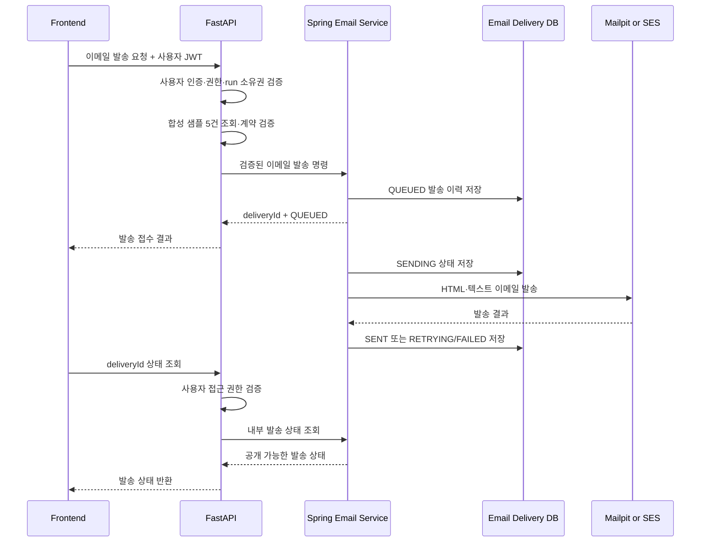

# Spring 이메일 전송 서비스 아키텍처 검토 요청서

## 1. 문서 목적

현재 시스템은 FastAPI가 사용자 인증·권한과 AI Agent 파이프라인을 담당하고 있다. 고객이 데이터 선별 결과로 생성된 합성 샘플 5건을 이메일로 받을 수 있도록 기능을 추가하려 한다.

초기에는 FastAPI와 Celery가 SMTP 이메일을 직접 발송하도록 구현했으나, 팀 논의 후 이메일 발송과 발송 이력은 별도의 Spring 서비스가 담당하는 방향으로 변경했다. 이 문서는 변경된 구조가 적절한지 다른 개발자 또는 에이전트에게 검토받기 위한 자료다.

## 2. 현재 프로젝트 구조

```text
Bigproject/
├── docker-compose.yml
├── Backend3/          # FastAPI, Agent, Celery, SSE
├── Backend-spring/    # 신규 Spring 내부 이메일 서비스
└── Frontend_2/        # 사용자 화면
```

주요 구성 요소는 다음과 같다.

- Frontend: 데이터 요청, Agent 진행 상태 표시, HITL 승인·반려, 이메일 발송 버튼
- FastAPI: JWT 인증, 권한과 요청 소유권 검증, 데이터 선별·가공 Agent, 샘플 조회 API, SSE
- Celery/Redis: Agent 비동기 실행과 진행 상태 전달
- Spring: FastAPI가 요청한 고객 이메일 발송, 발송 이력과 재시도 관리
- PostgreSQL/Neon: 파이프라인 데이터와 이메일 발송 이력 저장
- Mailpit: 로컬 SMTP 테스트
- Amazon SES: 추후 운영 환경의 외부 고객 이메일 발송

## 3. 확정한 책임 분리

### FastAPI 책임

- 사용자 JWT 인증
- 이메일 발송 권한과 `runId` 소유권 검증
- 완료된 데이터 선별 단계 조회
- 저장된 합성 샘플이 정확히 5건인지 검증
- `metadata.is_synthetic == true` 검증
- Spring 내부 이메일 API 호출
- Spring이 반환한 `deliveryId`와 상태를 프론트에 전달
- 발송 상태 조회 요청 시 사용자 권한을 검증한 후 Spring 상태 API 호출

### Spring 책임

- FastAPI의 신뢰된 내부 요청만 접수
- 전달받은 합성 샘플을 HTML·텍스트 이메일로 렌더링
- Mailpit 또는 Amazon SES로 이메일 발송
- 이메일 발송 이력 저장
- 중복 발송 방지
- 비동기 발송, 실패 재시도 및 최종 실패 처리
- 내부 발송 상태 조회 API 제공
- SMTP·SES 내부 오류를 외부 공개 메시지로 변환

### Spring이 담당하지 않는 것

- 일반 사용자의 JWT 인증 및 권한 정책
- 데이터 선별 또는 가공 Agent 실행
- `StageRun.output_payload` 직접 조회·해석
- FastAPI의 파이프라인 상태 변경
- 사용자에게 직접 공개되는 Agent API 또는 SSE

## 4. 권장 요청 흐름



핵심 결정은 프론트가 Spring을 직접 호출하지 않는다는 것이다. 모든 사용자 요청은 FastAPI 인증·인가를 먼저 통과하고, Spring은 내부 이메일 전송 서비스로만 동작한다.

## 5. FastAPI 공개 API 초안

### 샘플 이메일 발송

```http
POST /api/v1/runs/{runId}/sample-preview/email
Authorization: Bearer <user-jwt>
Content-Type: application/json

{
  "recipient": "customer@example.com",
  "resend": false
}
```

응답 예시:

```json
{
  "delivery_id": 31,
  "run_id": 123,
  "status": "QUEUED",
  "recipient": "cu******@example.com",
  "message": "샘플 이메일 발송이 접수되었습니다."
}
```

### 이메일 발송 상태 조회

```http
GET /api/v1/email-deliveries/{deliveryId}
Authorization: Bearer <user-jwt>
```

FastAPI는 `deliveryId`가 현재 사용자에게 허용된 `runId`에 속하는지 검증해야 한다. 이를 위해 Spring 상태 응답에 `runId`와 요청 주체 식별 정보가 포함되어야 한다.

## 6. Spring 내부 API 초안

### 내부 이메일 접수

```http
POST /internal/v1/email-deliveries
X-Internal-Service-Key: <service-secret>
Content-Type: application/json
```

요청 예시:

```json
{
  "runId": 123,
  "stageAttemptNo": 1,
  "requestedBy": 7,
  "recipient": "customer@example.com",
  "resend": false,
  "request": {
    "requestNo": "REQ-20260806-ABC123",
    "title": "서울 지역 결제 분석",
    "requesterName": "홍길동"
  },
  "sample": {
    "columns": [
      {
        "name": "merchant_region",
        "dataType": "string",
        "derived": false,
        "description": "가맹점 지역"
      },
      {
        "name": "payment_count",
        "dataType": "integer",
        "derived": true,
        "description": "결제 건수"
      }
    ],
    "rows": [
      {"merchant_region": "서울", "payment_count": 1},
      {"merchant_region": "서울", "payment_count": 2},
      {"merchant_region": "서울", "payment_count": 3},
      {"merchant_region": "서울", "payment_count": 4},
      {"merchant_region": "서울", "payment_count": 5}
    ],
    "metadata": {
      "isSynthetic": true,
      "sampleCount": 5,
      "notice": "실제 고객 데이터가 아닌 형식 확인용 합성 샘플입니다."
    }
  }
}
```

응답 예시:

```json
{
  "deliveryId": 31,
  "runId": 123,
  "status": "QUEUED"
}
```

### 내부 상태 조회

```http
GET /internal/v1/email-deliveries/{deliveryId}
X-Internal-Service-Key: <service-secret>
```

Spring은 사용자 JWT를 해석하지 않는다. FastAPI가 사용자를 인증하고 Spring은 서비스 간 요청만 인증한다.

## 7. 샘플 전달 방식 결정

현재 권장안은 FastAPI가 검증한 샘플 스냅샷을 Spring 요청 본문에 포함하는 방식이다.

장점:

- Spring이 FastAPI 공개 샘플 API를 다시 호출할 필요가 없다.
- 사용자 JWT를 Spring이 보관하거나 FastAPI로 재전달하지 않아도 된다.
- Spring이 `StageRun.output_payload` 내부 형식에 직접 의존하지 않는다.
- 발송 당시의 샘플 스냅샷을 발송 이력과 함께 추적할 수 있다.
- 이메일 발송 시점에 파이프라인 데이터가 변경되어도 발송 내용이 달라지지 않는다.

주의점:

- Spring 내부 요청 DTO와 FastAPI 클라이언트 DTO의 계약 버전 관리가 필요하다.
- 샘플 5건의 크기 제한을 둬야 한다.
- 로그에 샘플 본문과 이메일 주소가 출력되지 않도록 해야 한다.
- Spring도 행 개수, 컬럼 일치, 합성 여부를 방어적으로 재검증해야 한다.

## 8. 서비스 간 인증

### 로컬 개발

- `X-Internal-Service-Key` 사용
- 키는 환경변수로만 주입
- Git 저장소와 로그에 실제 키를 남기지 않음
- Spring 내부 API는 Docker 내부 네트워크에서만 접근

### AWS 운영 권장안

- Spring을 private subnet 또는 내부 ECS Service로 배치
- 외부 인터넷에서 Spring 내부 API 직접 접근 차단
- 내부 ALB 보안 그룹 또는 서비스 디스커버리 사용
- 가능하면 IAM 기반 인증 또는 짧은 만료시간의 서명된 서비스 토큰 사용
- 정적 서비스 키를 사용할 경우 AWS Secrets Manager로 관리하고 회전 정책 적용

서비스 키 하나만으로 사용자 권한을 대체하지 않는다. 사용자 권한은 FastAPI에서 완료하고 Spring에는 감사에 필요한 `requestedBy`만 전달한다.

## 9. 이메일 발송 이력 소유권

이메일 발송 이력 테이블과 마이그레이션은 Spring이 단독 소유한다. FastAPI와 Spring이 동일 발송 행을 함께 수정하면 안 된다.

권장 필드:

| 필드 | 목적 |
|---|---|
| `id` | 발송 식별자 |
| `run_id` | FastAPI 파이프라인 실행 식별자 |
| `stage_attempt_no` | 발송한 선별 결과 버전 |
| `requested_by` | FastAPI가 확인한 사용자 식별자 |
| `recipient` | 실제 수신 이메일 |
| `recipient_normalized` | 중복 판정용 정규화 주소 |
| `delivery_type` | `SELECTION_SAMPLE` 등 발송 유형 |
| `status` | 발송 상태 |
| `provider` | `SMTP`, `SES` |
| `provider_message_id` | 제공자 메시지 식별자 |
| `attempt_count` | 실제 발송 시도 횟수 |
| `failure_code` | 내부 분류 가능한 실패 코드 |
| `failure_reason` | 내부 운영용 실패 내용 |
| `created_at` | 최초 접수 시각 |
| `updated_at` | 최종 변경 시각 |
| `delivered_at` | 발송 완료 시각 |

샘플 전체를 DB에 저장할지는 추가 검토가 필요하다. 재현성과 감사가 중요하면 암호화 또는 제한된 보존 기간을 적용해 스냅샷을 저장하고, 그렇지 않으면 샘플 해시와 템플릿 버전만 저장하는 방식을 고려한다.

## 10. 발송 상태와 재시도

```text
QUEUED → SENDING → SENT
             └──→ RETRYING → SENDING
                         └──→ FAILED
```

권장 규칙:

- 연결 실패, 제한 초과, 일시적인 SES 오류: 제한된 횟수로 재시도
- 잘못된 수신 주소, 인증 실패, 계약 오류: 즉시 최종 실패
- 내부 오류 전문은 프론트에 노출하지 않음
- 이메일 API 요청과 SMTP 발송을 같은 HTTP 트랜잭션에서 처리하지 않음
- 초기 구현은 `@Async`가 가능하지만 프로세스 종료 시 작업 유실 가능성이 있음
- 운영에서는 DB Outbox 또는 SQS 기반 비동기 처리를 권장

## 11. 중복 발송 방지

중복 판정 기준 후보:

```text
runId + stageAttemptNo + recipientNormalized + deliveryType
```

권장 동작:

- `QUEUED`, `SENDING`, `RETRYING`: 기존 발송 건 반환
- `SENT`: `resend=false`이면 기존 건 반환
- `FAILED`: `resend=false`이면 기존 실패 건 반환
- `resend=true`: 진행 중인 발송이 없을 때만 새 발송 생성
- 동시 요청은 애플리케이션 조회만으로 막지 말고 DB 제약 또는 idempotency key로 방지

## 12. 보안 및 개인정보 주의사항

- 이메일 주소와 샘플 행 전체를 일반 로그에 남기지 않음
- 프론트 응답에서는 이메일 주소를 마스킹
- Spring 상태 API의 내부 실패 원인을 FastAPI가 그대로 전달하지 않음
- HTML 템플릿에 삽입되는 모든 동적 값을 escape 처리
- 합성 샘플만 발송 가능하도록 FastAPI와 Spring 양쪽에서 검증
- 샘플 행과 이메일 발송 이력의 보존 기간 정의
- 운영 SES 발신 도메인, 반송·불만 처리 및 suppression 정책 설계
- 사용자 입력 수신자를 허용할지, 계약 또는 고객 정보에 등록된 주소만 허용할지 정책 확정

## 13. 현재 구현 상태

- FastAPI 샘플 조회 API 존재:
  - `GET /api/v1/runs/{runId}/sample-preview`
  - 사용자 JWT와 요청 소유권 검증 적용
  - 합성 샘플 정확히 5건 검증
- FastAPI의 SMTP·Celery 이메일 발송 구현은 제거함
- FastAPI 이메일용 Alembic 마이그레이션은 제거했으며 Neon에 적용하지 않음
- 신규 Spring 프로젝트 생성:
  - 경로: `Bigproject/Backend-spring`
  - Java 21
  - Spring Boot 4.0.7
  - Gradle
  - Web, Validation, Actuator, Mail
  - Docker 빌드 성공
- Spring 내부 이메일 API, DB 모델, Mailpit 발송은 아직 구현하지 않음
- FastAPI의 Spring 호출용 이메일 공개 API와 내부 클라이언트도 아직 구현하지 않음

## 14. 권장 구현 순서

1. FastAPI-Spring 내부 이메일 요청·응답 DTO 확정
2. Spring 내부 이메일 접수 API 구현
3. FastAPI의 사용자 인증 이메일 API와 Spring HTTP 클라이언트 구현
4. Spring HTML·텍스트 템플릿과 Mailpit SMTP 발송 구현
5. Spring 발송 이력 테이블 및 마이그레이션 확정
6. 중복 방지, 비동기 처리, 재시도 구현
7. FastAPI를 통한 발송 상태 조회 프록시 구현
8. Docker Compose 통합 및 로컬 E2E 검증
9. AWS 배포 시 Amazon SES와 운영 큐로 전환

## 15. 다른 에이전트에게 요청할 검토 질문

아래 사항을 무조건 동의하지 말고 냉정하게 검토해 달라.

1. 사용자 인증·권한은 FastAPI, 이메일 발송과 이력은 Spring이 소유하는 경계가 명확한가?
2. 프론트가 Spring을 직접 호출하지 않고 FastAPI가 Spring을 호출하는 구조가 적절한가?
3. FastAPI가 샘플 스냅샷을 Spring에 전달하는 방식과 Spring이 FastAPI에서 다시 조회하는 방식 중 어느 쪽이 더 안전한가?
4. 이메일 발송 이력 테이블은 Spring 전용으로 새로 만드는 것이 맞는가, 기존 `service.deliveries`를 Spring이 소유하는 것이 맞는가?
5. `@Async`로 시작하는 것이 현재 단계에서 충분한가, 처음부터 Outbox 또는 SQS를 적용해야 하는가?
6. 제안한 중복 발송 키와 `resend` 정책에 경쟁 조건이나 누락된 사례가 있는가?
7. 서비스 간 인증을 로컬 서비스 키에서 AWS IAM 또는 서명 토큰으로 전환하는 계획이 적절한가?
8. 샘플 스냅샷을 DB에 저장하는 것이 개인정보·감사·재현성 관점에서 필요한가?
9. 장애, 타임아웃, 부분 성공 상황에서 보완해야 할 보상 처리나 상태가 있는가?
10. 이 구조가 현재 프로젝트 규모에 과도하게 복잡하거나 반대로 운영 안정성이 부족한 부분은 없는가?

검토 결과에는 권장 구조, 반대 의견, 위험도, 최소 구현안과 운영 전 필수 보완사항을 구분해서 제시해 달라.
